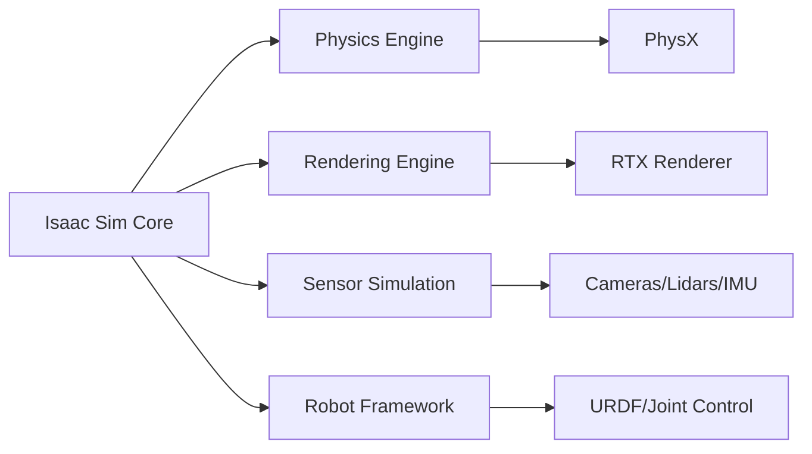

# Chapter 1: Introduction to Isaac Sim

NVIDIA Isaac Sim is a powerful robotics simulation platform that enables developers to design, test, and deploy AI-powered robots in realistic virtual environments. This chapter introduces you to the fundamentals of Isaac Sim and how to set up your first simulation.

## Learning Objectives

After completing this chapter, you will:
- Understand Isaac Sim's architecture and features
- Set up Isaac Sim on your system
- Create your first simulation scene
- Work with basic physics and materials
- Understand the simulation workflow

## 1.1 What is Isaac Sim?

Isaac Sim is built on NVIDIA's **Omniverse** platform and provides:
- **Photorealistic rendering** with RTX technology
- **Advanced physics simulation** including rigid body dynamics, fluids, and particles
- **AI integration** with support for reinforcement learning
- **ROS 2 integration** for seamless robot control
- **Cloud collaboration** for team-based development

### Key Components



## 1.2 Installation and Setup

### System Requirements

**Minimum Requirements:**
- Ubuntu 20.04/Windows 10/Windows 11
- NVIDIA RTX GPU with 8GB+ VRAM
- 16GB RAM
- 50GB free disk space

**Recommended:**
- NVIDIA RTX 3090/4090 with 24GB+ VRAM
- 32GB+ RAM
- SSD storage

### Installation Steps

1. **Download Isaac Sim**
```bash
# Ubuntu 20.04
wget https://developer.nvidia.com/isaac-sim/downloads
# Follow the installation guide for your specific version
```

2. **Set Environment Variables**
```bash
export ISAAC_SIM_PATH=/path/to/isaac-sim
export PYTHONPATH=$ISAAC_SIM_PATH:$PYTHONPATH
```

3. **Verify Installation**
```bash
python3 -c "import isaacsim; print('Isaac Sim installed successfully')"
```

## 1.3 Isaac Sim User Interface

The Isaac Sim interface consists of several key panels:

### Main Viewport
- **3D Scene View**: Visualize and interact with your simulation
- **Timeline**: Control simulation playback
- **Toolbar**: Quick access to common tools

### Stage Panel
- **Scene Hierarchy**: View and manage all objects in the scene
- **Properties Panel**: Edit object properties and components

### Content Browser
- **Asset Library**: Access pre-built assets and materials
- **Import/Export**: Manage external assets

## 1.4 Creating Your First Scene

Let's create a simple simulation with a robot arm and a table.

### Step 1: Create a New Stage

```python
from isaacsim import SimulationApp

# Initialize simulation
simulation_app = SimulationApp({"headless": False})

import omni.kit.commands
from omni.isaac.core import World
from omni.isaac.core.objects import VisualCuboid

# Create world
world = World()
```

### Step 2: Add a Ground Plane

```python
from omni.isaac.core.objects import GroundPlane

# Add ground plane
ground_plane = world.scene.add(
    GroundPlane(
        prim_path="/World/defaultGroundPlane",
        size=1000.0
    )
)
```

### Step 3: Create a Table

```python
# Create table top
table_top = world.scene.add(
    VisualCuboid(
        prim_path="/World/Table/top",
        position=[0, 0, 0.75],
        size=[1.0, 1.0, 0.05],
        color=[0.8, 0.6, 0.4]
    )
)

# Create table legs
for x_pos, y_pos in [(-0.4, -0.4), (0.4, -0.4), (-0.4, 0.4), (0.4, 0.4)]:
    leg = world.scene.add(
        VisualCuboid(
            prim_path=f"/World/Table/leg_{x_pos}_{y_pos}",
            position=[x_pos, y_pos, 0.375],
            size=[0.05, 0.05, 0.75],
            color=[0.6, 0.4, 0.2]
        )
    )
```

### Step 4: Add a Robot Arm

```python
from omni.isaac.core.robots import Robot

# Load Franka Emika robot
franka = world.scene.add(
    Robot(
        prim_path="/World/Franka",
        name="franka",
        usd_path="http://omniverse-content-production.s3-us-west-2.amazonaws.com/Assets/Robots/Franka/FRANKA_Robotic_Arm.usd",
        position=[0, 0, 0.925]
    )
)
```

## 1.5 Physics Simulation

### Enable Physics

```python
from omni.physx.scripts import physicsUtils

# Enable physics for objects
physicsUtils.add_physics_material_to_prim(
    "/World/Table/top",
    static_friction=0.5,
    dynamic_friction=0.5,
    restitution=0.1
)

# Enable collision
physicsUtils.set_collider("/World/Table/top", approximationShape="cube")
```

### Add Rigid Body Dynamics

```python
from omni.isaac.core.objects import DynamicCuboid

# Add a falling cube
falling_cube = world.scene.add(
    DynamicCuboid(
        prim_path="/World/FallingCube",
        name="falling_cube",
        position=[0, 0, 2.0],
        size=[0.1, 0.1, 0.1],
        color=[0.2, 0.2, 0.8],
        mass=1.0
    )
)
```

## 1.6 Simulation Loop

```python
# Simulation settings
world.reset()

# Run simulation
while simulation_app.is_running():
    # Step physics
    world.step(render=True)

    # Get cube position
    cube_pos = falling_cube.get_world_pose()
    print(f"Cube position: {cube_pos[0]}")

    # Stop if cube falls too low
    if cube_pos[0][2] < -1.0:
        break

# Cleanup
simulation_app.close()
```

## 1.7 Working with Sensors

### Add a Camera

```python
from omni.isaac.sensor import Camera

# Add camera to the scene
camera = world.scene.add(
    Camera(
        prim_path="/World/Camera",
        position=[2.0, 0.0, 2.0],
        frequency=30,
        resolution=(640, 480)
    )
)

# Initialize camera
camera.initialize()

# Capture image
world.step(render=True)
rgba_image = camera.get_rgba()
```

### Add a Lidar

```python
from omni.isaac.sensor import LidarRigidBody

# Add lidar sensor
lidar = world.scene.add(
    LidarRigidBody(
        prim_path="/World/Lidar",
        name="lidar",
        position=[0, 0, 3.0],
        rotation=[90, 0, 0],  # Point downward
        horizontal_fov=360,
        vertical_fov=30,
        horizontal_resolution=360,
        vertical_resolution=16,
        max_range=10.0,
        min_range=0.1
    )
)
```

## 1.8 ROS 2 Integration

### Enable ROS 2 Bridge

```python
# Import ROS 2 bridge
from omni.isaac.ros2_bridge import ROS2Bridge

# Initialize ROS 2 bridge
bridge = ROS2Bridge()

# Publish camera images
camera.create_ros_publisher("camera/image_raw", "sensor_msgs/Image")
```

### Control Robot via ROS 2

```python
# Add ROS 2 control to Franka
franka.set_robot_ros2_control("franka")

# Now you can control the robot via ROS 2 topics:
# /franka/controller_commands
# /franka/joint_states
```

## 1.9 Best Practices

### Performance Optimization

1. **Level of Detail (LOD)**: Use appropriate LOD for complex objects
2. **Physics Substeps**: Adjust based on simulation requirements
3. **Culling**: Enable frustum culling for large scenes

### Scene Organization

```python
# Organize your scene with proper prim paths
/World/
  /Environment/
    /Ground/
    /Lighting/
  /Robots/
    /Franka/
    /MobileRobot/
  /Objects/
    /ManipulationObjects/
    /NavigationObstacles/
  /Sensors/
    /Cameras/
    /Lidars/
```

## 1.10 Common Issues and Solutions

| Issue | Solution |
|-------|----------|
| Simulation runs slowly | Reduce physics precision, simplify assets |
| Objects pass through each other | Check collision settings and material properties |
| ROS 2 bridge not working | Ensure ROS 2 environment is sourced before launching Isaac Sim |

## Summary

In this chapter, you learned:
- Isaac Sim's architecture and features
- How to install and set up Isaac Sim
- Creating basic simulation scenes
- Adding physics and dynamics
- Working with sensors
- ROS 2 integration basics

## Next Steps

In the next chapter, we'll explore **Advanced Robot Control** including inverse kinematics and motion planning in Isaac Sim.

## Exercises

1. Create a scene with multiple colored cubes falling onto a table
2. Add a conveyor belt and simulate object transport
3. Create a pick-and-place scenario with the Franka robot
4. Experiment with different material properties and friction values
5. Set up a ROS 2 node to visualize sensor data in RViz