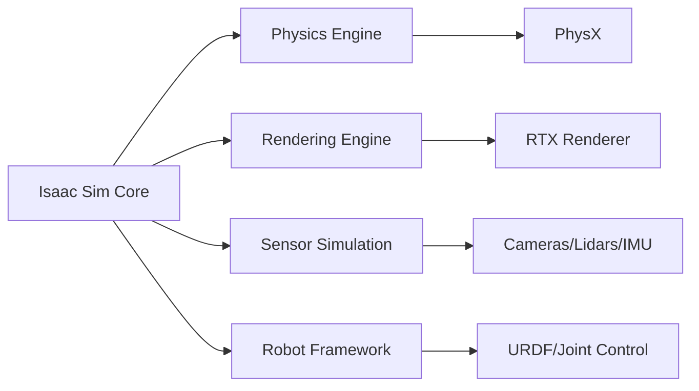

# باب 1: Isaac Sim کا تعارف

NVIDIA <GlossaryTooltip termId="isaac-sim">Isaac Sim</GlossaryTooltip> ایک طاقتور روبوٹکس سیمولیشن پلیٹ فارم ہے جو ڈویلپرز کو حقیقت پسندانہ ورچوئل ماحول میں AI سے چلنے والے روبوٹس ڈیزائن، ٹیسٹ اور deploy کرنے کی سہولت دیتا ہے۔ یہ باب آپ کو Isaac Sim کی بنیادی باتوں اور اپنی پہلی سیمولیشن سیٹ اپ کرنے کا طریقہ متعارف کراتا ہے۔

## سیکھنے کے مقاصد

اس باب کو مکمل کرنے کے بعد، آپ:
- Isaac Sim کے فن تعمیر اور خصوصیات کو سمجھیں گے
- اپنے سسٹم پر Isaac Sim سیٹ اپ کریں گے
- اپنا پہلا سیمولیشن سین بنائیں گے
- بنیادی فزکس اور materials کے ساتھ کام کریں گے
- سیمولیشن ورک فلو کو سمجھیں گے

## 1.1 Isaac Sim کیا ہے؟

Isaac Sim NVIDIA کے **Omniverse** پلیٹ فارم پر بنایا گیا ہے اور فراہم کرتا ہے:
- RTX ٹیکنالوجی کے ساتھ **فوٹوریلسٹک رینڈرنگ**
- rigid body dynamics، fluids، اور particles سمیت **پیشرفتہ فزکس سیمولیشن**
- reinforcement learning کی سپورٹ کے ساتھ **AI انٹیگریشن**
- بغیر کسی رکاوٹ روبوٹ کنٹرول کے لیے **<GlossaryTooltip termId="ros-2">ROS 2</GlossaryTooltip> انٹیگریشن**
- ٹیم پر مبنی ڈویلپمنٹ کے لیے **کلاؤڈ تعاون**

### اہم اجزاء



## 1.2 انسٹالیشن اور سیٹ اپ

### سسٹم کی ضروریات

**کم از کم ضروریات:**
- Ubuntu 20.04/Windows 10/Windows 11
- 8GB+ VRAM کے ساتھ NVIDIA RTX GPU
- 16GB RAM
- 50GB خالی ڈسک اسپیس

**تجویز کردہ:**
- 24GB+ VRAM کے ساتھ NVIDIA RTX 3090/4090
- 32GB+ RAM
- SSD سٹوریج

### انسٹالیشن کے مراحل

1. **Isaac Sim ڈاؤن لوڈ کریں**
```bash
# Ubuntu 20.04
wget https://developer.nvidia.com/isaac-sim/downloads
# اپنے مخصوص ورژن کے لیے انسٹالیشن گائیڈ فالو کریں
```

2. **Environment Variables سیٹ کریں**
```bash
export ISAAC_SIM_PATH=/path/to/isaac-sim
export PYTHONPATH=$ISAAC_SIM_PATH:$PYTHONPATH
```

3. **انسٹالیشن کی تصدیق کریں**
```bash
python3 -c "import isaacsim; print('Isaac Sim کامیابی سے انسٹال ہو گیا')"
```

## 1.3 پہلا سیمولیشن سین بنانا

آئیے ایک سادہ سین بنائیں جس میں ایک فرش اور ایک کیوب ہو:

```python
from omni.isaac.kit import SimulationApp

# سیمولیشن شروع کریں
simulation_app = SimulationApp({"headless": False})

import omni
from omni.isaac.core import World
from omni.isaac.core.objects import DynamicCuboid

# ورلڈ بنائیں
world = World()

# گراؤنڈ پلین شامل کریں
world.scene.add_default_ground_plane()

# ایک متحرک کیوب شامل کریں
cube = world.scene.add(
    DynamicCuboid(
        prim_path="/World/Cube",
        name="cube",
        position=[0, 0, 1.0],
        size=0.3,
        color=[1, 0, 0]
    )
)

# سیمولیشن چلائیں
world.reset()
while simulation_app.is_running():
    world.step(render=True)

simulation_app.close()
```

:::tip تجربہ کریں
کیوب کی پوزیشن اور سائز تبدیل کر کے دیکھیں کہ فزکس سیمولیشن کیسے کام کرتی ہے!
:::

## خلاصہ

اس باب میں ہم نے سیکھا:
- Isaac Sim کیا ہے اور اس کی اہم خصوصیات
- Isaac Sim کو انسٹال اور سیٹ اپ کرنا
- ایک سادہ سیمولیشن سین بنانا

:::info اگلا باب
[باب 2: <GlossaryTooltip termId="urdf">URDF</GlossaryTooltip> روبوٹ ماڈلز](/docs/module-2-isaac-sim/chapter-2-urdf) میں ہم روبوٹ ماڈلز بنانا اور لوڈ کرنا سیکھیں گے۔
:::
